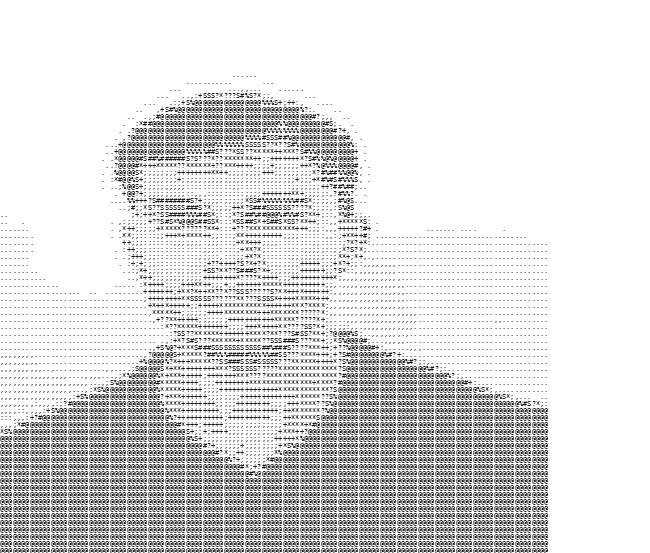

<!--
  github.com/crissness — profile README
-->

<picture>
  <source media="(prefers-color-scheme: dark)" srcset="assets/ascii-dark.gif">
  
</picture>

<p align="center">
<a href="https://www.linkedin.com/in/cristianpanza"></a>
</p>

---

### `~ my stack`

<p>
<a href="https://www.python.org"></a>
<a href="https://flask.palletsprojects.com"></a>
<a href="https://supabase.com"></a>
<a href="https://render.com"></a>
<a href="https://www.microsoft.com/excel"></a>
<a href="https://www.anthropic.com"></a>
</p>

---

### `~ about me`

```
Name           ░░░░░░░░░░  Cristian
Surname        ░░░░░░░░░░  Panza
Role           ░░░░░░░░░░  Auditor & Builder
Currently      ░░░░░░░░░░  Building Valuation Lab — DCF/WACC modeling platform
Methodology    ░░░░░░░░░░  Damodaran
Random facts   ░░░░░░░░░░  Italian, 110L/110, gym every day, morning meditator
```

---

### `~ by the numbers`

```
years of experience              ░░░░░░░░░░     2
companies audited                ░░░░░░░░░░   40+
largest consolidated group       ░░░░░░░░░░   €1B
degree grade                     ░░░░░░░░░░  110L
```

---

### `~ a day`

```mermaid
%%{init: {'theme':'base','themeVariables':{
  'taskBkgColor':'#0A66C2',
  'taskBorderColor':'#0A66C2',
  'taskTextColor':'#ffffff',
  'taskTextLightColor':'#ffffff',
  'taskTextDarkColor':'#ffffff',
  'taskTextOutsideColor':'#0A66C2',
  'critBkgColor':'#3ECF8E',
  'critBorderColor':'#3ECF8E',
  'textColor':'#0A66C2',
  'titleColor':'#3ECF8E',
  'sectionBkgColor':'transparent',
  'altSectionBkgColor':'transparent',
  'gridColor':'#0A66C2',
  'tickColor':'#0A66C2',
  'todayLineColor':'#3ECF8E'
}}}%%
gantt
  dateFormat HH:mm
  axisFormat %H:%M

  section Morning
    Breakfast & meditation      :07:30, 90m

  section Work
    Audit & analysis            :09:00, 240m

  section Break
    Reading & lunch             :crit, 13:00, 60m

  section Work
    Valuation Lab & deep work   :14:00, 240m

  section Evening
    Gym                         :18:00, 60m
    Personal projects           :19:00, 120m
    Dinner                      :crit, 21:00, 60m
```



